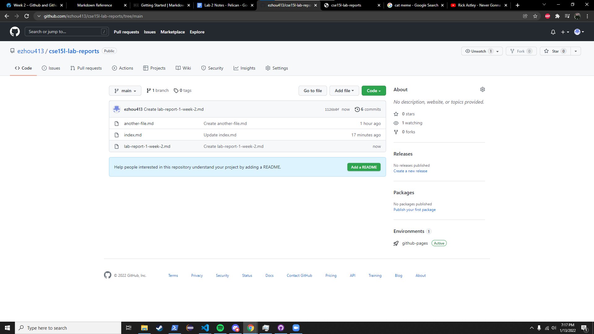

[Lab Report 1](lab-report-1-week-2.html)

[Lab Report 2](lab-report-2-week-4.html)

[Lab Report 3](lab-report-3-week-6.html)

[Lab Report 4](lab-report-4-week-8.html)


here is a block of code 
```
System.out.println("hello world");
```


# To Do List
* finish this lab
* finish cse12 pa2
* [(╯°□°）╯︵ ┻━┻](https://youtu.be/dQw4w9WgXcQ)



[Link][1]
⋮
[1]: https://youtu.be/dQw4w9WgXcQ


## another change
---
