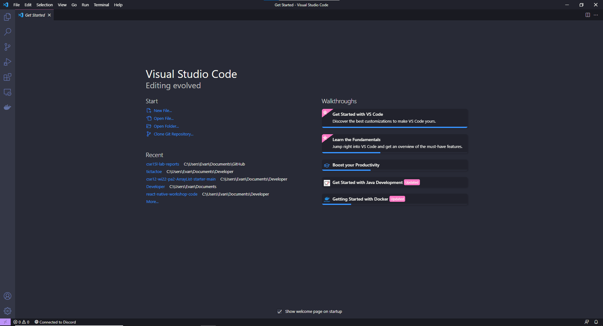
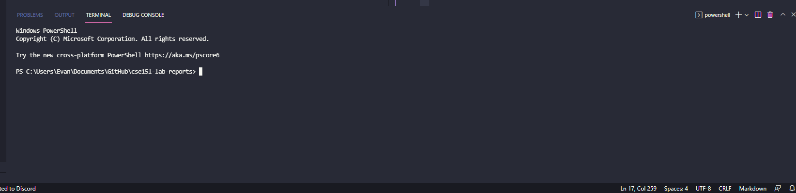
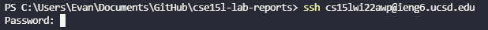
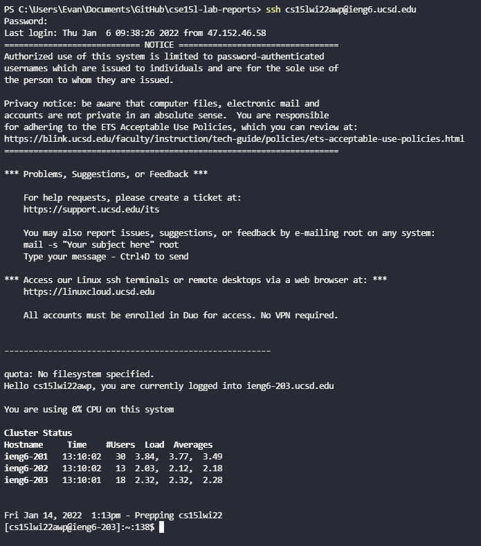
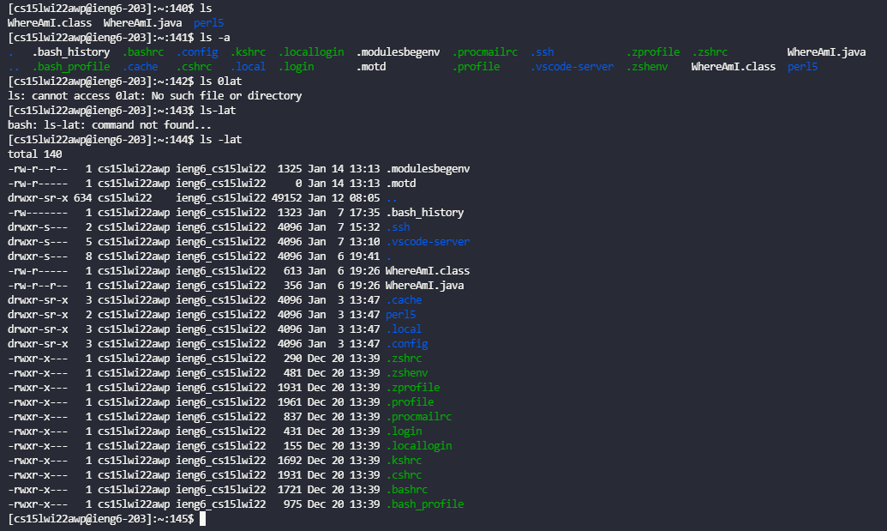
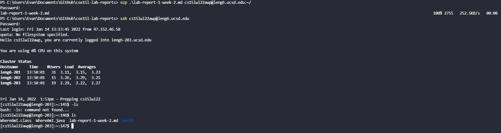
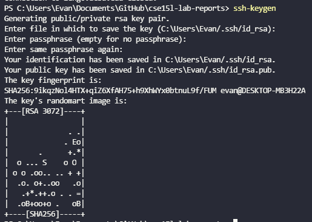
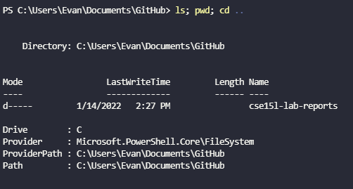

# How To Log Into ieng6 - CSE 15L

In this tutorial, you will learn how to log into your course specific ieng6 account. The ieng6 computers are the computers in the basement of the engineering building at UCSD, and through this tutorial, you will learn how to remotely connect to those computers from anywhere. 

## Step 1
First, find your account login information here: [Link](https://sdacs.ucsd.edu/~icc/index.php)

Next, install Visual Studio Code (VSCode) from this link: [Link](https://code.visualstudio.com/download)

Follow the installation process, and once you're done, you should see a screen that looks something like this:



## Step 2
After you've installed VSCode, it is time to remotely connect to the ieng6 computers using ssh, or **s**ecure **sh**ell.

Start by opening the terminal in VSCode. This can be done by either clicking the terminal tab in the menu at top of your screen, then clicking "New Terminal", or by pressing Ctrl + \` in Windows, or Command + \` on MacOS ( \` is the key above tab and to the left of the 1 key). You should see something like this at the bottom of your screen in VSCode: 



Once you see this screen, type in the command `ssh cs15lwi22***@ieng6.ucsd.edu` where the three stars are replaced by the three letters for your specific account you found in step 1. The terminal will then prompt you to put in your password: 



**IMPORTANT**: When you enter your password, nothing will show up in the terminal. This is intentional for obvious reasons, and if you just enter your password then hit enter, you will be logged in. This is what your terminal should look like after you've logged in successfully: 



## Step 3

Now that you've logged into your ieng6 account, it's now time to try out some commands. Some commands you can try on both your own computer and the ieng6 computer are: 
* `ls` (if on Windows, try `dir`)
* `pwd`
* `ls -a`
* `cd`
* `cd ..`



If you would like to logout from your ieng6 account, you can either type exit into the command line, or press Ctrl + D. 

## Step 4

Now, you might be wondering, how can I move files from my personal computer to the ieng6 servers? File transfer can be done through the `scp` command, which means **s**ecure **c**o**p**y. To scp a file, run this command on your personal computer:

```scp [file name] cs15lwi22***@ieng6.ucsd.edu:~/```

where [file name] is the name of the file you would like top copy over to the server. 

Now you can log back into your ieng6 account, enter the `ls` command, and you should see the file you copied in your home directory!



## Step 5

One thing you can do to reduce the amount of time over the course of this class spent on typing your password when logging in is to set up an ssh key. An ssh key is a unique identifier, like a password, that allows the server to identify your computer when logging in using ssh, or when using scp for files, so that you don't have to enter your password anymore. 

To set up an ssh key, type in `ssh-keygen` into your terminal to generate a new ssh key. Press enter for each of the prompts without entering anything, which results in the default settings. When the setup process has been finished, you should see a screen similar to this screenshot: 



## Step 6

There are some ways to make running commands on a remote computer more efficient, one of which, was setting up an ssh key to remove the step of entering a password on each login. A short list of other tips and tricks to save a little bit of time are: 

* using the up arrow to recall your previously entered commands
* having a notepad with commonly run commands to copy-paste from
* running several commands in a line using semicolons:


## Conclusion

I hope this tutorial was helpful in learning how to login to your ieng6 account, and that my tips and tricks were helpful!