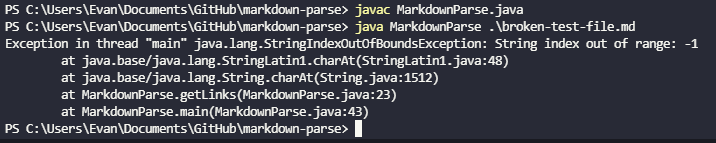

# Lab Report 2

## Code Change 1
---

Screenshot of code change diff

[Link to failure inducing test file](https://github.com/ezhou413/markdown-parse/blob/53bfcdc7dea29c846e5a64ae84d0657f85f6e85f/broken-test-file.md)

Symptom of the failure inducing input at the command line: 

For this situation, we passed in a file containing an image link marked as an image in the .md file, which MarkdownParse took in as a link, printing it out as an output. Here, the bug in the code is when we check for the `!` character before the opening bracket `[`. This code didnt work as intended, leading the failure inducing input containing the image link to produce the incorrect output containing the image as a part of our ArrayList of links - the symptom.

## Code Change 2
---

[Link to failure inducing test file](https://github.com/ezhou413/markdown-parse/blob/13a98eeeae8c7d8597549d055893e6714008eddf/broken-test-file2.md)

Symptom of the failure inducing input at the command line: 

For this bug, we found that if an image was at the beginning of the .md file - our failure inducing input, our code would end up in an infinite loop due to the method of which the code would loop through indicies. This issue was indicated by the symptom of an unresponsive terminal. To fix this, we added an if statement checking if the character before the opening bracket `[` was an exclamation mark `!`. If it was, we would not add the substring containing the link to the ArrayList, and if it wasnt, we would add the link. 

## Code Change 3
---

[Link to failure inducing test file](https://github.com/ezhou413/markdown-parse/blob/13a98eeeae8c7d8597549d055893e6714008eddf/broken-test-file.md)

Symptom of the failure inducing input at the command line: 

For this bug, we noticed in certain situations when checking if a substring was an image or not, we would get an IndexOutOfBoundsException due to the nature of our check being a charAt check, which is the symptom. We figured out that in the failure inducing input, one of our variables for the location of the parentheses or brackets were -1, causing this IndexOutOfBoundsException. To fix this, we implemented a try catch, telling our program to increment currentIndex and continue to the next iteration of the while loop. 