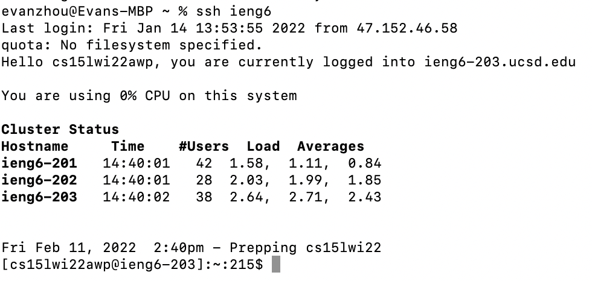

# Lab Report 3

## How To Further Streamline Your ssh Configuration

When we first set up ssh keys, our login process looked something like this:

```
$ ssh cs15lwi22awp@ieng6.ucsd.edu
Password: 
```
In between then and now, we set up ssh keys to streamline the login process a little bit, making it so you don't have to enter your password when logging in. This process was detailed in [lab report 1](lab-report-1-week-2.html). 

In this lab report, we will be talking about how to further streamline the ```ssh``` login process. 

---

All ssh related files are stored in the hidden directory ```~/.ssh```, and in that directory, there is a file called config that stores the settings of your ```ssh``` configuration. If it doesn't exist, then create the file in the ```~/.ssh``` directory on your own computer, naming it ```config```.

In your ```config``` file, enter this:


Make sure your username is your own (as in replace 'awp' with the three letters in your cs15l account username)

After you complete this, instead of ping out your entire username and the hostname, all you have to type is:

```
ssh ieng6
```

This is a screenshot of this command running on my own computer:



Do note that you can change the phrase after host to whatever you like, as that is similar to a variable in Java. Though the 'HostName' and 'User' lines are fixed, with no flexibility for creativity. 

This streamlined methof of using ```ssh``` also applies to ```scp```, allowing you to securely copy files over to the ieng6 servers without typing out your entire username and hostname. To ```scp``` using this method, put this command into your terminal:

```$ scp [file name] ieng6:~/```

where you enter the file(s) you want to ```scp``` in the file name section. Here's a screenshot of it running on my own computer:


And there you go! I hope this helps you save lots of valuable time when using ```ssh``` and ```scp```!