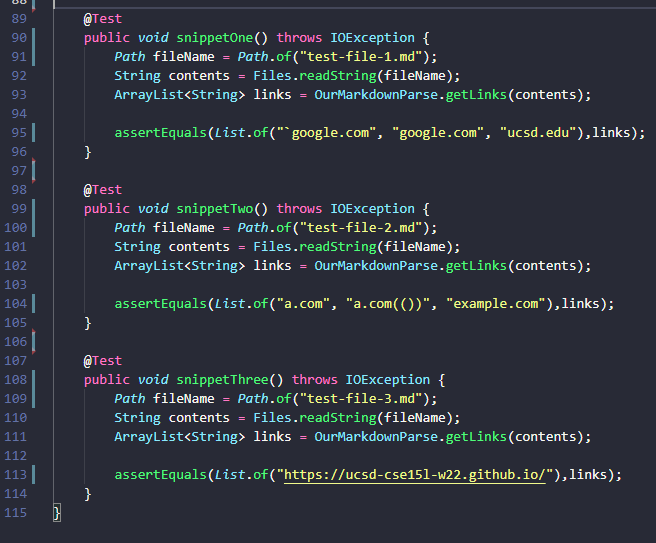
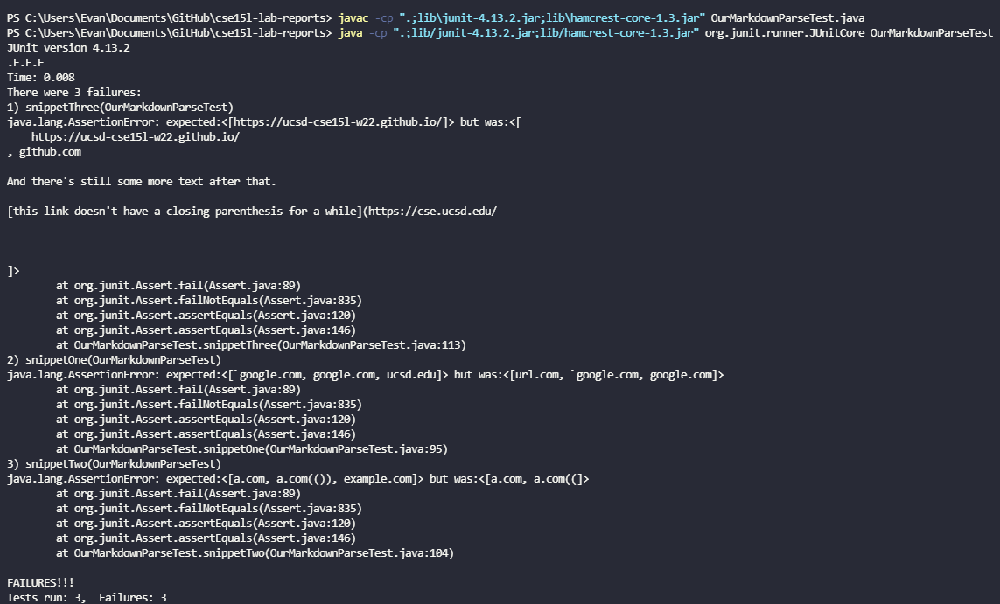
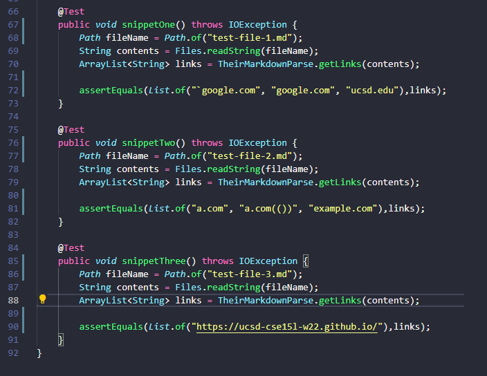
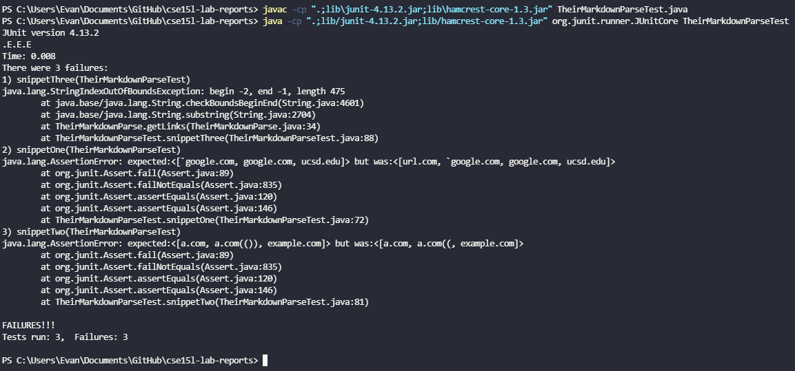

# Lab Report 4

Link to our MarkdownParse repo [here](https://github.com/ezhou413/markdown-parse).

Link to the MarkdownParse repo my group reviewed [here](https://github.com/sm52/markdown-parse).

--- 

For each of the code snippets listed in the lab report guide, here is what I think each test should produce: 

### Snippet 1

```[`google.com, google.com, ucsd.edu]```

### Snippet 2

```[a.com, a.com(()), example.com]```

### Snippet 3

```[https://ucsd-cse15l-w22.github.io/]```

*Note: My group's code is prefixed with 'our', and the group we reviewed's code is prefixed with 'their'*

Here is the screenshot of the JUnit tests for my group's code:



Here is the screenshot of the tests running on the code of my group:



Here is the screenshot of the JUnit tests for the group we reviewed:



Here is the screenshot of the tests running on the code of the group we reviewed:



Both implementations of MarkdownParse failed all three of the code snippets given in this lab report. 

---
### Snippet 1
Q: Do you think there is a small (<10 lines) code change that will make your program work for snippet 1 and all related cases that use inline code with backticks? If yes, describe the code change. If not, describe why it would be a more involved change.

A: For snippet 1, a check for backticks similar to how the check for the exclamation mark was implemented could be added to the code. In the code, an additional check for backticks would be added before the substring containing the link is added to the output list.

### Snippet 2
Q: Do you think there is a small (<10 lines) code change that will make your program work for snippet 2 and all related cases that nest parentheses, brackets, and escaped brackets? If yes, describe the code change. If not, describe why it would be a more involved change.

A: To handle all cases that involve nested parentheses and brackets, I think the fix would be a more involved change, as your code would have to track the number of opening parentheses or brackets in the string, but also know when the parentheses or bracket is a valid one in terms of the link. There would also need to be a section of code that tells you if the bracket or parentheses is within another pair of brackets or parentheses, so the code would know to treat it as a part of the markdown syntax for a link or actual text contained by the link. On the other hand, escaped brackets would be a simple change similar to the check for the exclamation mark for Images, with the code treating any character following the backslash `\` as an escaped character. 

### Snippet 3
Q: Do you think there is a small (<10 lines) code change that will make your program work for snippet 3 and all related cases that have newlines in brackets and parentheses? If yes, describe the code change. If not, describe why it would be a more involved change.

A: To handle new lines within brackets and parentheses, a similar philosophy to the exclamation mark and blackslash check would be followed. My idea is to check if the substring between the opening and closing parentheses or brackets contains a new line, and if it does, invalidate the link, and move onto the next section of the markdown file. 